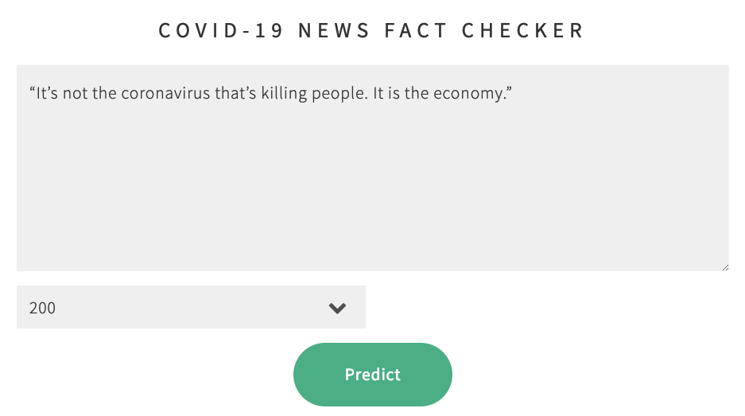

# <center><b>Real Anot</b>: identifying COVID-19-related fake news using machine learning</center>
<center>Barry YAP, Kelvin SOH, Kenny CHUA and Zhong Hao NEO</center>
<center>AI Apprentices, Batch 6, AI Singapore</center>

## Introduction
Your phone buzzes to notify you of a new message in your extended family's WhatsApp chat. The message contains claims regarding COVID-19, but you're not sure if this information is trustworthy? Is it a case of fake news?

Fake news is a form of intentional disinformation. When this disinformation is unquestioning taken as true, this can potentially result in severe negative consequences, particularly in the current COVID-19 climate.

<b>Real Anot</b> is a web app that uses machine learning technology to predict the probability that given piece text is fake news. Larger probability values means that the text is more likely to be fake news.

## Dataset
The dataset is a subset of the CoAid dataset which containts a set of diverse COVID-19 healthcare misinformation. This dataset has a total of 1,127 real and 266 fake news samples.

## Preprocessing
The preprocessing stages consists of
- Columnwise concatenation (Text & Content)
-  Stopwords removal, lemmatization
- TF-IDF
- Undersampling of real news

## Model
The model is a simple Logistic regression with uncertainty built into the predictions which makes it "Bayesian logistic regression". The model is trained using stochastic variational inference (SVI) with Pyro, the purpose is to show that we can approximate any functions using a well-behaved distribution such as Normal dist. Using variational inference, the goal is to maximize the evidence lower bound **ELBO** such that the **KL divergence** between the posterior distribution **P** and the variational distribution **Q** are minimized. The parameters of the logistic regression model weight **W** and bias **b** are parameterized by an initial prior normal distribution **w, b ~ N(0, 10)**.

The goal is to define a variational distribution **Q** to approximate the parameters of the posterior **P**. The initial parameters used for **Q** are **w,b ~ N(eps, -8 + 0.05eps)** where **eps ~ N(0,1)** 

The following is our true posterior distribution **P(Z|X)** with parameters **Z** conditioned on observed data **X** which we want to approximate.


With the above priors set in place we train the model using SVI for 3000 iterations by optimizing both the parameters of **P** and **Q** simultaneously using Tfidf vector as our input data.

Using a well behaved distribution **Q** e.g. Normal dist. Using SVI the lower bound of the true posterior **P** is found at around 500 iterations (Notice the shape of the two distribution **P** and **Q**).


### Making inference
To perform a prediction, we sample **n** number of times from our approximated variational distribution **Q** and take the expectation under the approximated **Q**, this is equivalent to computing the weighted average from the ensembles of plain logistic regression model each with a different parameter values. These ensembles are drawn from the same shared distributions with the ability to express uncertainty in their estimates. 

As shown below, 200 samples of weights **W** and bias **b** are drawn from the variational distribution **Q**.


## Evaluation
Evaluation is done on the 20% test samples for both model. As shown in the following table below, the Bayesian model refuses to predict 13 samples as it is not confident in their predicions scores. When compared to the baseline logistic regression model, Bayesian model only got 3 incorrect predictions while Logistic regression got 7 incorrect predictions. 


This shows that by incorporating uncertainty into the model, we have a much better confidence in the predictions returned from the model, or by having a 3rd party opinion in cases of uncertainty circumstances.


## Demo app
- Instructions for launching the demo app
```
$ python -m src.app
```
After running the above command, the app will run on http://localhost:8000. Where user can input a piece of news information and perform a prediction, the number of Bayesian samples 2, 5, 10, 200, 500 can be selected to maximize the prediction confidence of any particular news.



The predictions returned is a form of probability distribution where x-axis is the predicted probabilities from the 200 Bayesian samples by taking the median probability.

 


## References
https://github.com/cuilimeng/CoAID/ <br>
https://pyro.ai/ <br>
https://pyro.ai/examples/svi_part_i.html <br>
https://arxiv.org/pdf/1506.04416.pdf <br>
https://www.cs.princeton.edu/courses/archive/fall11/cos597C/lectures/variational-inference-i.pdf